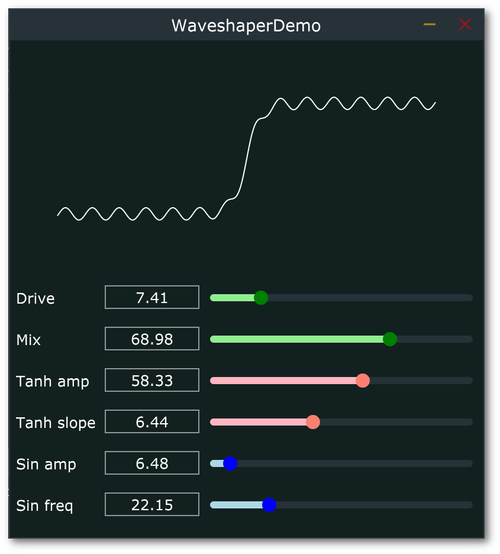

# waveshaper-demo

Simple Waveshaping effect with tweakable transfer function.

([here is a video](https://youtu.be/p1vSqWyyqf0) of the plugin in action inside Ableton Live 10)

## Description

The input signal's level is first scaled via the DRIVE control, and then passed through the transfer function. 
The MIX control allow to blend between the original and modified signals. 

The tranfers function is made of two building blocks:

* an [hyperbolic tangent](http://mathworld.wolfram.com/HyperbolicTangent.html) component (with adjustable "slope" and amplitude)
* a [sinusoidal](https://en.wikipedia.org/wiki/Sine_wave) component with (adjustable frequency and amplitude)

By tweaking those parameters (TANH SLOPE and SINE FREQ) and the relative amplitudes (TANH AMP and SIN AMP), it is possible to come up with different shapes and thus different audible effects (see [video](https://youtu.be/p1vSqWyyqf0))

## Useful resources & Info

* [Fifty shades of distortion (ADC17)](https://www.youtube.com/watch?v=oIChUOV_0w4): great video/tutorial about distortion in general, including waveshaping and more. 

* [Concise explanation of waveshaping](http://sites.music.columbia.edu/cmc/MusicAndComputers/chapter4/04_06.php)).
